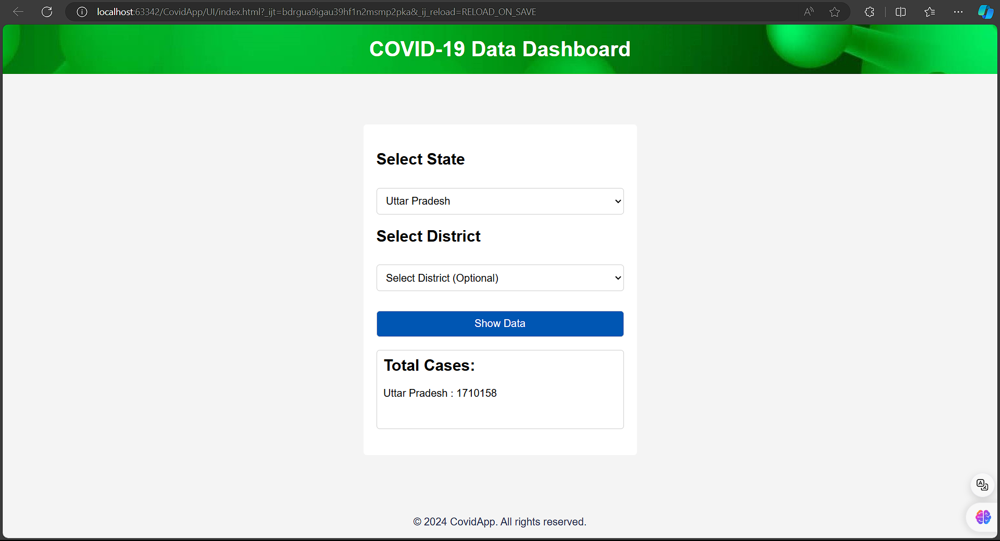
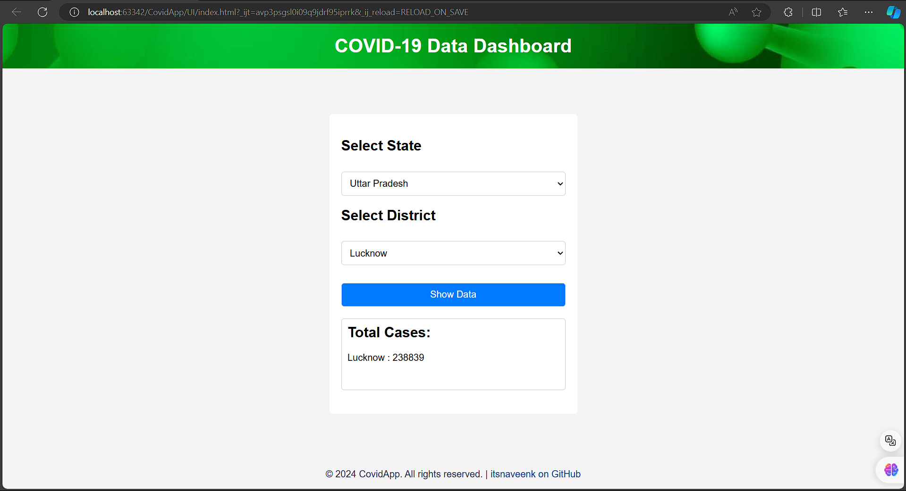

# CovidApp

## Introduction

CovidApp is a web application that provides real-time COVID-19 data for different states and districts in India. The data is fetched from a reliable API and is updated regularly.

## Usage

To use the application, simply select the state and district from the dropdown menus on the homepage. The application will display the total number of confirmed COVID-19 cases for the selected region.

## Documentation

The application is built using Java, Spring Boot for the backend, and JavaScript for the frontend. Maven is used for dependency management.

### Backend

The backend is a Spring Boot application that fetches data from an external API. The data is then cached and served to the frontend.

### Frontend

The frontend is a simple HTML/CSS/JavaScript application. It fetches data from the backend and updates the UI accordingly.

## Installation

To install and run the application locally, follow these steps:

1. Clone the repository: `git clone https://github.com/itsnaveenk/CovidApp.git`
2. Navigate to the project directory: `cd CovidApp`
3. Install the dependencies: `mvn install`
4. Run the application: `mvn spring-boot:run`

The application will be accessible at `http://localhost:8080`.

## Contributing

Contributions are welcome. Please fork the repository and create a pull request with your changes.

## License

This project is licensed under the MIT License. See the `LICENSE` file for more details.